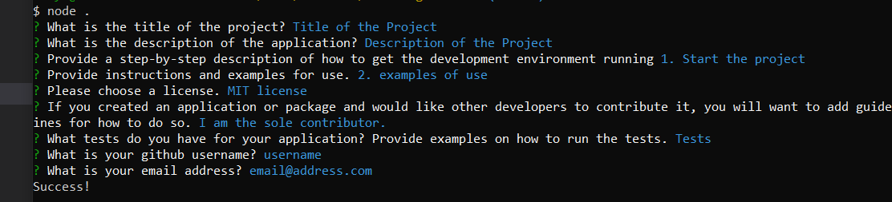

# README-generator 

## Table of Contents
[Description](#Description)
[Installation](#Installation)
[Usage](#Usage)
[License](#License)
[Contribution](#Contribution)
[Questions](#Questions)

## Description
This application gives the user a series of questions in the command line. This application creates a dynamically generated README.md file based on the user input. 

## Installation
Download the application into your project and run npm install in the command line to download the dependencies. 

## Usage
After downloading the dependencies, run node in the command line in the application to initiate the question process. The README will be generated automatically after all questions have been answered. 

## License
MIT license

## Contribution
If you would like to contribute to this project, please contact me first. 

## Questions
Please visit my github profile abbynf or email me at abbynfrandsen@gmail.com if you have any questions.
